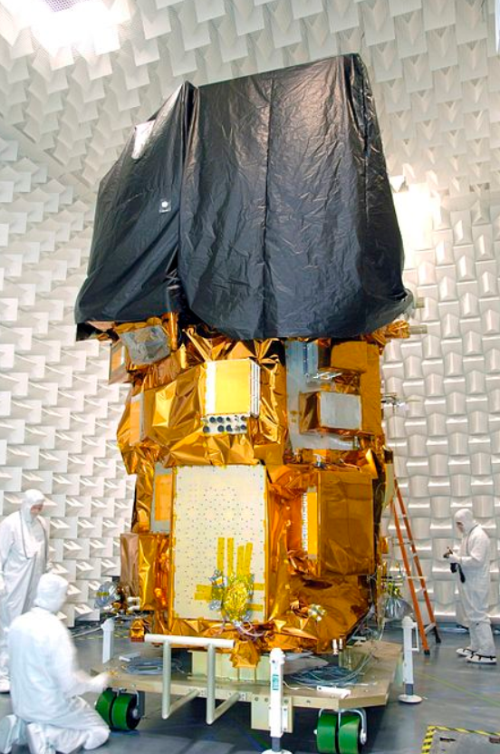
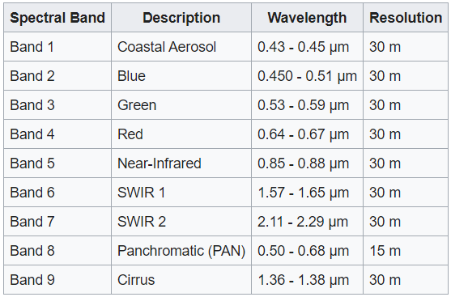
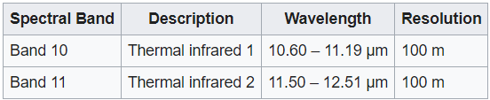
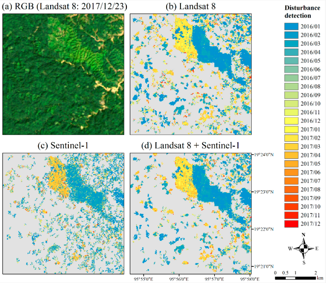
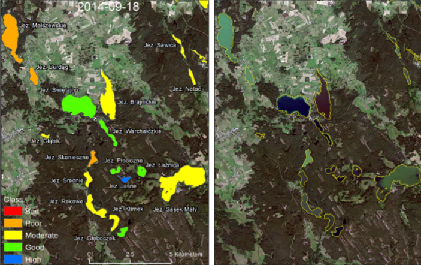

class: inverse, center, middle
```{r xaringan-themer, include=FALSE, warning=FALSE}
library(xaringanthemer)
style_mono_light(
  base_color = "#23395b",  
  #header_font_google = google_font("Josefin Sans"),
  #text_font_google   = google_font("Montserrat", "300", "300i"),
  #code_font_google   = google_font("Fira Mono")
  title_slide_background_image = "img/milky.jpg"
)
```

```{r echo=FALSE, message=FALSE, warning=FALSE}
library(knitcitations)
library(RefManageR)
BibOptions(check.entries = FALSE,
           bib.style = "authoryear",
           cite.style = "authoryear",
           style = "markdown",
           hyperlink = TRUE,
           dashed = FALSE,
           no.print.fields=c("doi", "url", "urldate", "issn"))
myBib <- ReadBib("./Week2.bib", check = FALSE)
```

# Summary


### 1. General Overview

### 2. Instruments

---

### General Overview

[**Landsat 8**](https://landsat.gsfc.nasa.gov/satellites/landsat-8/#:~:text=The%20Landsat%208%20satellite%20payload,and%2015%20meters%20(panchromatic) was developed as a collaboration between NASA and the U.S. Geological Survey (USGS). 

.pull-left[
- Launched on February 11, 2013, from Vandenberg Air Force Base, California, on an Atlas-V 401 rocket, with the extended payload fairing (EPF) from United Launch Alliance, LLC.

- Landsat 8 orbits the Earth in a sun-synchronous, near-polar orbit (98.2 degrees inclination)

- Completes one Earth orbit every 99 minutes

]

.pull-right[
```{r echo=FALSE, out.width='60%', fig.align='center'}


```

.small.center[Landsat 8 during ground testing. Source: [**Wikipedia**](https://upload.wikimedia.org/wikipedia/commons/thumb/9/97/Landsat_Data_Continuity_Mission_Observatory_testing.jpg/450px-Landsat_Data_Continuity_Mission_Observatory_testing.jpg)]
]

---
## Instruments


- Landsat 8 carries two sensors. The Operational Land Imager (OLI) sensor is built by Ball Aerospace & Technologies Corporation. The Thermal Infrared Sensor (TIRS) is built by NASA Goddard Space Flight Center. 

- The improvement of Landsat 8 compare previous sensors is OLI. OLI is a push-broom sensor with a four-mirror telescope and 12-bit quantization. OLI collects data for visible, near infrared, and short wave infrared spectral bands as well as a panchromatic band.


.pull-left[
```{r echo=FALSE, out.width='70%', fig.align='center'}

```

.small.center[OLI Spectral Bands]
]

.pull-right[
```{r echo=FALSE, out.width='70%', fig.align='center'}

```

.small.center[TIRS Spectral Bands]
]
---
class: inverse, center, middle
# Application and Reflection


### 1. Example

### 2. Landsat 8 role

---
## Example of Landsat 8 Applications 

* Forest Management and Monitoring
  * `r Citet(myBib, "shimizuDetectingForestChanges2019")` disturbances in tropical seasonal forests based on a machine learning algorithm 

* Lake Water Assessment
  * `r Citet(myBib, "ANDRZEJURBANSKI201628")` classify lake quality for several classes using OLI2 and OLI4 bands
  
.pull-left[
```{r echo=FALSE, out.width='50%', fig.align='center'}

```
.small.center[Example of disturbance detection in the study area. Source: `r Citet(myBib, "shimizuDetectingForestChanges2019")`]
]

.pull-right[
```{r echo=FALSE, out.width='70%', fig.align='center'}

```
.small.center[The product created by the tool for assigning ecological classes for small part of image area. Source: `r Citet(myBib, "ANDRZEJURBANSKI201628")`]
]

---
background-image: url('https://storage.googleapis.com/earthengine-datasets/public/jpg/720/landsat_lc08_c01_t1_sr_riolaja.jpg')
background-size: cover
background-position: 60% 60%
class: center, bottom, inverse

# Landsat 8 Datasets in Earth Engine

---
# Reflection

### Landsat 8 Role
* Landsat 8 provides continuity with the more than 40-year long Landsat land imaging data set.
* Widespread routine use for land use planning and monitoring on regional to local scales, support of disaster response and evaluations, and water use monitoring.
* Landsat 8 measurements directly serve NASA research in the focus areas of climate, carbon cycle, ecosystems, water cycle, biogeochemistry, and Earth surface/interior.
* Landsat 8 is required to return at least 400 scenes per day to the USGS data archive (150 more than Landsat 7), increasing the probability of capturing cloud-free scenes for the global landmass.

---
class: inverse

# References
```{r results='asis', echo=FALSE, message=FALSE}
PrintBibliography(myBib, start = 1, end = 2)
```
